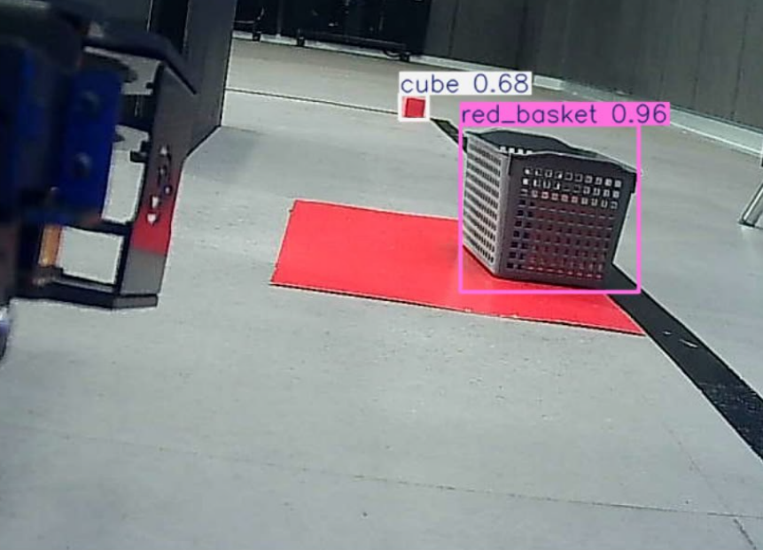
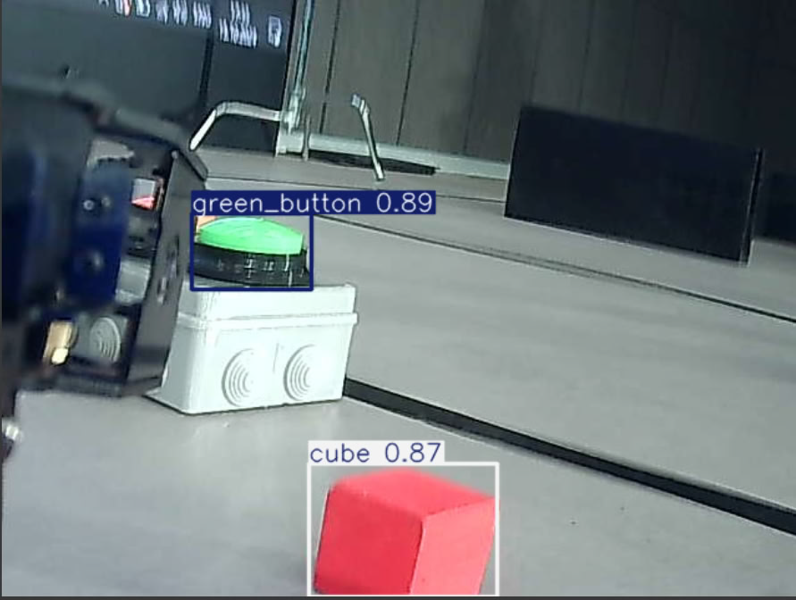
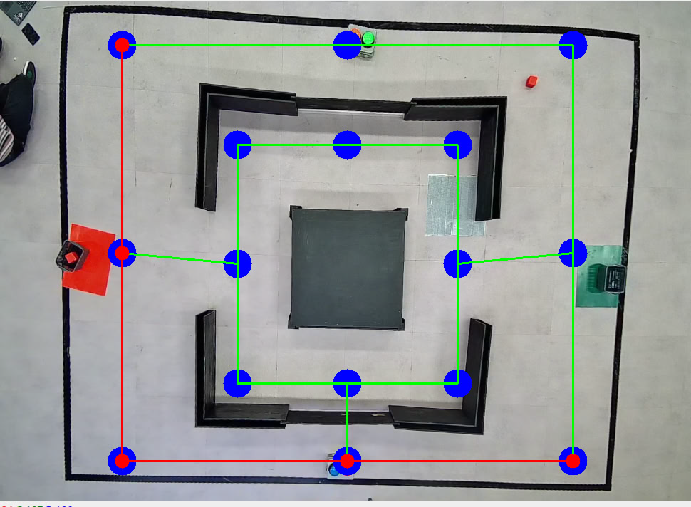
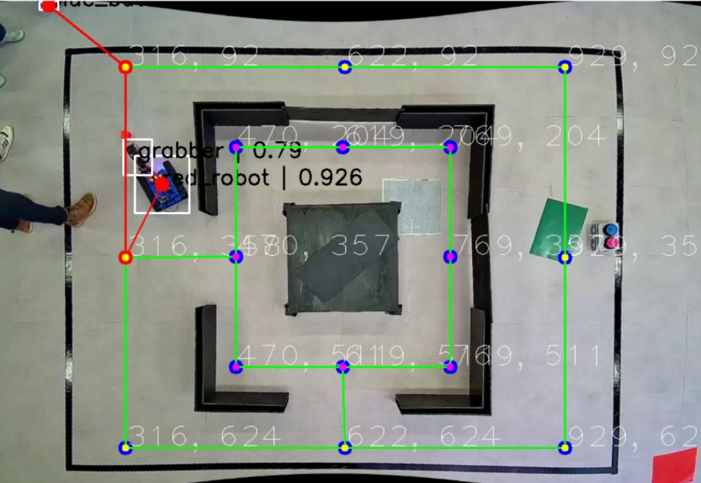

## ПО для управления роботом

### Определение объектов с камеры робота

    
    

- Используем обученную модель для классификации объектов
- Распознаем объект с камеры робота и выполняем движение к ним с корректировкой угла поворота
- В зависимости от того какой объект, выполняем различный скрипт (взятие, нажатие, отпускание)

### Определение пути в лабиринте

    
    

- Используем обученную модель для классификации объектов и определения конфигурации лабиринта
- Рисует граф по точкам равноудаленный от границ стен
- Определяем наше положение и положение цели
- Строим путь по графу от робота к цели используя обход в ширину
